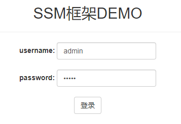
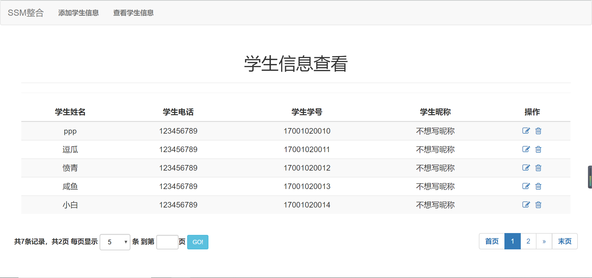

# 高级Web技术Lab 1： 申请服务器+创建VPC+Docker部署

## 概述

 Lab1的主要内容包括：

* 在AWS中申请自己的服务器
* 创建带有公网和私有子网的VPC

* **重点掌握Docker**，并使用Docker在服务器上部署一个简易的SSM程序
## Part 1：申请服务器

云服务器(Elastic Compute Service, ECS)是一种简单高效、安全可靠、处理能力可弹性伸缩的计算服务。其管理方式比物理服务器更简单高效。用户无需提前购买硬件，即可迅速创建或释放任意多台云服务器。

AWS对于信用卡使用者提供一定的免费时长（适用于Global账号；创建AWS中国区账号还需要额外提供企业有效证件），如果是教育用户则采取事先给予一定使用额度的方法，同学们在使用的时候要注意以下几点：

1、实例模板ec2.micro的创建是免费的，但是一个月的总使用时长只有750小时，这对于一台实例是完全够用一个月的，但是对于两台及两台以上就不够了。

2、申请弹性IP以后，如果不适用，也是会扣额度的。

具体的服务器申请指导文档见**./assets/material/Amazon AWS 使用教程.pdf**。文档中的注册地址可能已经过时（见此：[AWS Educate](https://www.awseducate.com/registration#APP_TYPE)）。

## Part 2： 创建带有公网和私有子网的VPC

虚拟私有云（Virtual Private Cloud, VPC）是存在于共享或公用云中的私有云，亦即一种网络云。借助VPC，可以在AWS云中预置一个逻辑隔离的部分，从而在自己定义的虚拟网络中启动AWS资源。你可以完全掌控这个虚拟联网环境，包括选择自己的IP地址范围、创建子网以及配置路由表和网络网关。

**注：AWS 账户若是在 2013 年 12 月 4 日之后创建的，它仅支持 EC2-VPC。在这种情况下，将在每个 AWS 区域拥有一个默认 VPC（默认 VPC 适用于快速入门和启动公共实例 (如博客或简单的网站)）。默认 VPC 可供使用，因此您不必创建和配置您自己的 VPC。您可以立即在默认 VPC 中启动 Amazon EC2 实例。您还可以在默认 VPC 中使用 Elastic Load Balancing、Amazon RDS 和 Amazon EMR 等服务。**

在[官方文档](https://docs.aws.amazon.com/zh_cn/vpc/latest/userguide/VPC_Scenario2.html)中有推荐的vpc配置，这里摘录重要的两段：

> 这个场景的配置包括一个有公有子网和私有子网的 Virtual Private Cloud (VPC)。如果您希望运行面向公众的 Web 应用程序，并同时保留不可公开访问的后端服务器，我们建议您使用此场景。常用例子是一个多层网站，其 Web 服务器位于公有子网之内，数据库服务器则位于私有子网之内。您可以设置安全性和路由，以使 Web 服务器能够与数据库服务器建立通信。

> 公有子网中的实例可直接将出站流量发往 Internet，而私有子网中的实例不能这样做。但是，私有子网中的实例可使用位于公有子网中的网络地址转换 (NAT) 网关访问 Internet。数据库服务器可以使用 NAT 网关连接到 Internet 进行软件更新，但 Internet 不能建立到数据库服务器的连接。

同学们可以按照这个默认的配置图配置。


关于“AWS VPC with Public and Private Subnets”的关键词在Youtube上有大量的视频演示配置操作，推荐同学们看[这个](https://www.youtube.com/watch?v=wG9En2X9FvM)。

具体的创建带有公网和私有子网的VPC关键步骤摘要见** ./assets/material/创建带有公网和私有子网的VPC.pdf **

## Part 3：使用Docker

实验要求：配置Docker并成功部署所给的简易java项目，项目源代码[见此](https://github.com/2021-web/lab1_Code.git)。

Docker 是一个开源的应用容器引擎，让开发者可以打包他们的应用以及依赖包到一个可移植的镜像中，然后发布到任何流行的 Linux或Windows 机器上，也可以实现虚拟化。

推荐同学们先去阅读**./assets/material/**文档中提供的三个文档，对Docker建立大概的了解。

### 1.准备Docker环境

下面演示在服务器环境是 Ubuntu 18.04 下安装Docker，既然采用的是亚马逊云服务器，服务器在国外，可以使用Docker官方文档的步骤来安装Docker。

链接[见此](https://docs.docker.com/install/linux/docker-ce/ubuntu/)。

**注意：**安装的是Docker CE版本。

使用`docker run hello-world`查看docker是否安装成功。（若出现权限问题：使用`sudo docker run hello-world`）

### 2.编写Dockerfile

```shell
mkdir maven_tomcat

cd maven_tomcat

vim Dockerfile
```

```Dockerfile
FROM maven:3.6.3-jdk-8

ENV CATALINA_HOME /usr/local/tomcat
ENV PATH $CATALINA_HOME/bin:$PATH
RUN mkdir -p "$CATALINA_HOME"
WORKDIR $CATALINA_HOME
ENV TOMCAT_VERSION 8.5.63
ENV TOMCAT_TGZ_URL https://downloads.apache.org/tomcat/tomcat-8/v$TOMCAT_VERSION/bin/apache-tomcat-$TOMCAT_VERSION.tar.gz
RUN set -x \
&& curl -fSL "$TOMCAT_TGZ_URL" -o tomcat.tar.gz \
&& tar -xvf tomcat.tar.gz --strip-components=1 \
&& rm bin/*.bat \
&& rm tomcat.tar.gz*
EXPOSE 8080
CMD ["catalina.sh", "run"]
```

解释：在一个maven基础镜像上叠加tomcat，最终运行java项目时只需要这一个镜像即可完成编译+打包+部署。

build此基础镜像

```shell
sudo docker build -t maven_tomcat .
```

使用`-t`参数指定镜像名称:标签，`.`表示使用当前目录下的 Dockerfile, 还可以通过-f 指定 Dockerfile 所在路径。

此时运行`docker images`应该可以看到一个叫`maven_tomcat`的镜像。

### 3.内网实例安装mysql

见**assets/material/mysql安装.pdf**

关键是保证安装完以后可以被远程访问。

### 4.构建应用镜像

基于此镜像， 将java应用通过maven编译打包到tomcat webapps目录，生成最终镜像。

```shell
git clone https://github.com/2021-web/lab1_Code.git

cd lab1_Code
```

此时有两件事要做，一是在私网实例中建数据库`ssm_demo`并执行目录中的sql语句建表；二是在`/src/main/resources/resource/jdbc.properties`文件中修改host、用户名和密码等。

### 5.运行容器

修改好配置文件后，在`lab1_Code`目录下，执行

```
docker build -t docker_demo .
```

最后，基于镜像，运行容器

```shell
# 创建并启动一个名为demo的docker容器，主机的8001端口映射docker容器的8080端口
sudo docker run -idt --name demo -p 8001:8080 docker_demo
# 模拟HTTP请求，测试浏览器是否能正常访问  
curl localhost:8001
```

### 6.安全组问题

如果使用 AWS 服务器，默认的安全组规则会拦截服务器的入站流量。为了能够正常访问，我们需要放开对 8001 端口的限制：

1. 进入 AWS 控制面板，点击左边的【安全组】
2. 点击下方的【入站】->【编辑】
3. 增加入站规则： HTTP 或 HTTPS 可以允许他人访问你服务器上的网址；自定义 TCP 端口 8001 ，允许来源 【任意位置】。

如果一切正常，就可以通过 服务器公网 IP:8001 浏览器来访问你的项目了。

使用用户名：admin，密码：admin登录。



平台截图：



## Part 4：提交

截止时间：2021/3/31-23:59:59

提交方式：将文档提交到超星指定的lab作业栏里，文档格式不限。


